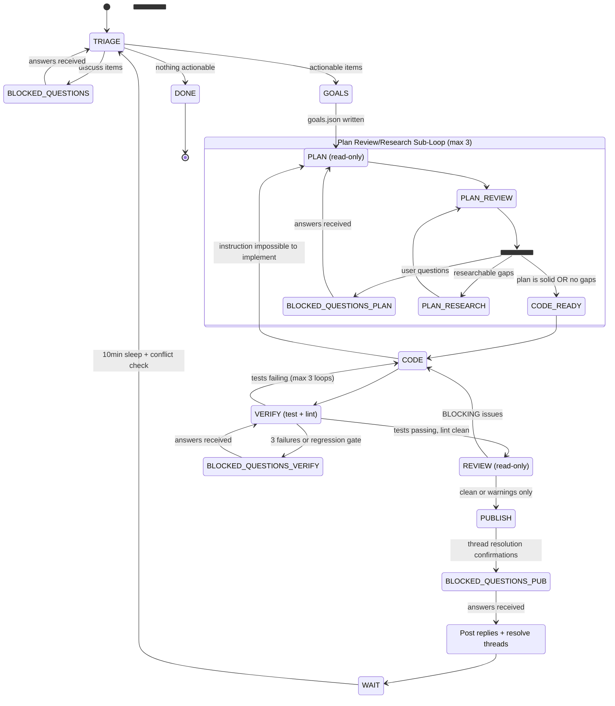
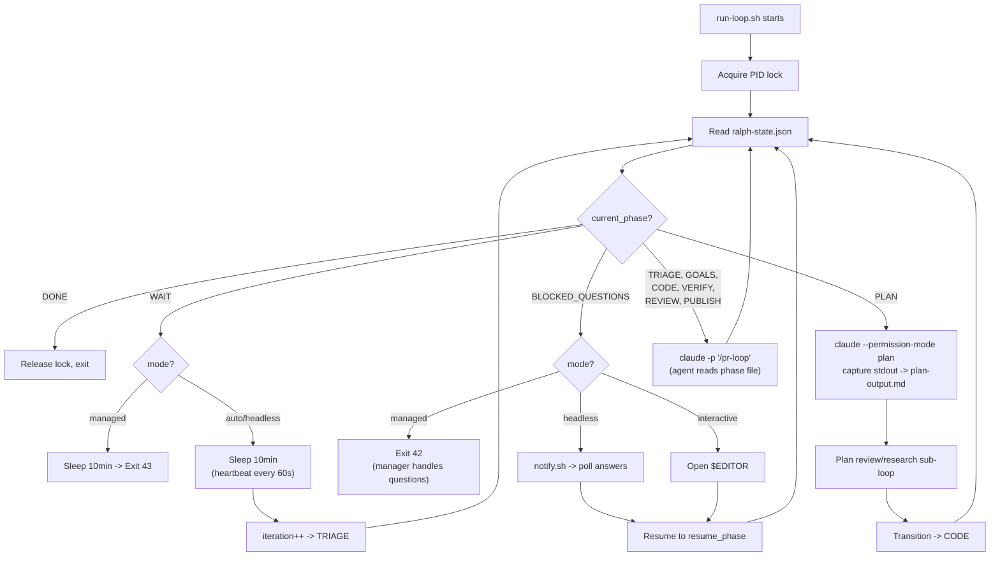
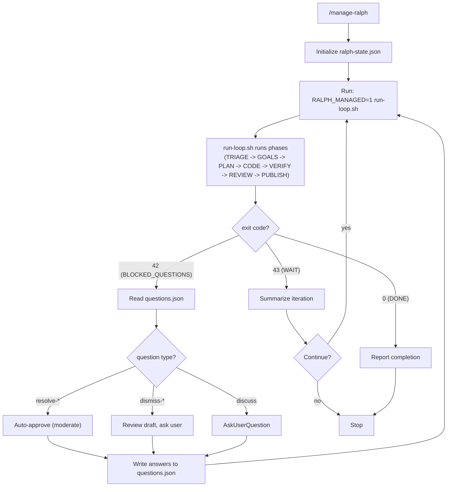

# Ralph Loop — State Diagrams

## Ralph Loop State Machine

```mermaid
stateDiagram-v2
    [*] --> TRIAGE

    TRIAGE --> BLOCKED_QUESTIONS : discuss items
    TRIAGE --> GOALS : actionable items
    TRIAGE --> DONE : nothing actionable

    state "GOALS" as GOALS
    GOALS --> PLAN : goals.json written

    state "PLAN (read-only)" as PLAN
    PLAN --> PLAN_REVIEW

    state plan_sub <<fork>>
    state plan_join <<join>>

    state "Plan Review/Research Sub-Loop (max 3)" as PlanSubLoop {
        PLAN_REVIEW --> plan_sub
        plan_sub --> CODE_READY : plan is solid OR no gaps
        plan_sub --> BLOCKED_QUESTIONS_PLAN : user questions
        plan_sub --> PLAN_RESEARCH : researchable gaps
        PLAN_RESEARCH --> PLAN_REVIEW
        BLOCKED_QUESTIONS_PLAN --> PLAN : answers received
    }

    CODE_READY --> CODE

    state "CODE" as CODE
    CODE --> VERIFY
    CODE --> PLAN : instruction impossible to implement

    state "VERIFY (test + lint)" as VERIFY
    VERIFY --> REVIEW : tests passing, lint clean
    VERIFY --> CODE : tests failing (max 3 loops)
    VERIFY --> BLOCKED_QUESTIONS_VERIFY : 3 failures or regression gate

    BLOCKED_QUESTIONS_VERIFY --> VERIFY : answers received

    state "REVIEW (read-only)" as REVIEW
    REVIEW --> CODE : BLOCKING issues
    REVIEW --> PUBLISH : clean or warnings only

    PUBLISH --> BLOCKED_QUESTIONS_PUB : thread resolution confirmations
    BLOCKED_QUESTIONS_PUB --> PUBLISH_RESUME : answers received

    state "Post replies + resolve threads" as PUBLISH_RESUME
    PUBLISH_RESUME --> WAIT

    WAIT --> TRIAGE : 10min sleep + conflict check

    BLOCKED_QUESTIONS --> TRIAGE : answers received

    DONE --> [*]
```

## Phase Execution Model (run-loop.sh)

```mermaid
flowchart TB
    start["run-loop.sh starts"] --> lock["Acquire PID lock"]
    lock --> read_state["Read ralph-state.json"]
    read_state --> dispatch{"current_phase?"}

    dispatch -->|DONE| exit["Release lock, exit"]
    dispatch -->|WAIT| wait_mode{"mode?"}
    wait_mode -->|managed| sleep_then_43["Sleep 10min -> Exit 43"]
    wait_mode -->|auto/headless| sleep["Sleep 10min<br/>(heartbeat every 60s)"]
    sleep --> bump["iteration++ -> TRIAGE"]
    bump --> read_state

    dispatch -->|BLOCKED_QUESTIONS| bq_mode{"mode?"}
    bq_mode -->|managed| exit_42["Exit 42<br/>(manager handles questions)"]
    bq_mode -->|headless| notify["notify.sh -> poll answers"]
    bq_mode -->|interactive| editor["Open $EDITOR"]
    notify --> resume["Resume to resume_phase"]
    editor --> resume
    resume --> read_state

    dispatch -->|PLAN| plan_capture["claude --permission-mode plan<br/>capture stdout -> plan-output.md"]
    plan_capture --> sub_loop["Plan review/research sub-loop"]
    sub_loop --> to_code["Transition -> CODE"]
    to_code --> read_state

    dispatch -->|"TRIAGE, GOALS,<br/>CODE, VERIFY,<br/>REVIEW, PUBLISH"| run_claude["claude -p '/pr-loop'<br/>(agent reads phase file)"]
    run_claude --> read_state
```

## Managed Mode (/manage-ralph)

```mermaid
flowchart TB
    user["/manage-ralph"] --> init["Initialize ralph-state.json"]
    init --> launch["Run: RALPH_MANAGED=1 run-loop.sh"]
    launch --> phases["run-loop.sh runs phases<br/>(TRIAGE -> GOALS -> PLAN -> CODE -> VERIFY -> REVIEW -> PUBLISH)"]
    phases --> exit{"exit code?"}

    exit -->|"42 (BLOCKED_QUESTIONS)"| read_q["Read questions.json"]
    read_q --> answer{"question type?"}
    answer -->|"resolve-*"| approve["Auto-approve (moderate)"]
    answer -->|"dismiss-*"| review_draft["Review draft, ask user"]
    answer -->|discuss| ask_user["AskUserQuestion"]
    approve --> write_a["Write answers to questions.json"]
    review_draft --> write_a
    ask_user --> write_a
    write_a --> launch

    exit -->|"43 (WAIT)"| summarize["Summarize iteration"]
    summarize --> continue{"Continue?"}
    continue -->|yes| launch
    continue -->|no| stop["Stop"]

    exit -->|"0 (DONE)"| report["Report completion"]
    report --> stop
```
