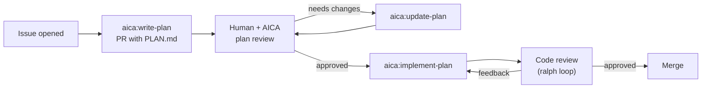

# Pydantic Harness

Composable, reusable capabilities for [Pydantic AI](https://ai.pydantic.dev/) agents.

## Why?

[Pydantic AI](https://github.com/pydantic/pydantic-ai) is a production-grade agents framework used by hundreds of thousands of developers. Its core must remain robust and reliable, which means a strict review process for contributions.

But agents need more than what's in core -- memory, guardrails, approval workflows, cost tracking, and dozens of other behaviors that are common but don't belong in a framework's foundation.

**Pydantic Harness** is the composition layer. Each capability is an [`AbstractCapability`](https://ai.pydantic.dev/capabilities/) subclass that hooks into the agent graph via lifecycle hooks, providing tools, instructions, and model settings in a single reusable unit.

Instead of submitting a PR to pydantic-ai, build a capability. Ship it as a package. Share it with the community.

## Installation

```bash
pip install pydantic-harness
```

Or with uv:

```bash
uv add pydantic-harness
```

Requires Python 3.10+ and `pydantic-ai-slim>=1.76.0`.

## Quick start

```python
from pydantic_ai import Agent
from pydantic_harness import InputGuardrail, CostGuard

agent = Agent(
    'openai:gpt-4o',
    capabilities=[
        InputGuardrail(guard=lambda text: 'DROP TABLE' not in text),
        CostGuard(max_total_tokens=5000),
    ],
)

result = agent.run_sync('Summarize the latest news.')
```

## Available capabilities

| Capability | Description | Status |
|---|---|---|
| [Guardrails](docs/capabilities/guardrails.md) | Validate inputs/outputs, enforce cost/tool constraints | Implemented |
| AdaptiveReasoning | Dynamically adjust reasoning effort based on task complexity | Planned |
| Approval | Require human approval before executing sensitive operations | Planned |
| Compaction | Compress conversation history to stay within context limits | Planned |
| FileSystem | Read, write, and navigate the local filesystem | Planned |
| KnowsCurrentTime | Inject the current date and time into the system prompt | Planned |
| Memory | Persistent key-value memory across agent sessions | Planned |
| Planning | Break complex tasks into plans before execution | Planned |
| RepoContextInjection | Inject repository structure and context into the system prompt | Planned |
| SecretMasking | Detect and redact secrets in agent inputs and outputs | Planned |
| SessionPersistence | Save and restore full conversation sessions | Planned |
| Shell | Execute shell commands with safety controls | Planned |
| Skills | Progressive tool loading via search and activate | Planned |
| SlidingWindow | Keep conversation history within a sliding token window | Planned |
| StuckLoopDetection | Detect and break out of repetitive agent loops | Planned |
| SubAgent | Delegate subtasks to specialised child agents | Planned |
| SystemReminders | Inject periodic reminders into the conversation | Planned |
| ToolErrorRecovery | Automatically retry or recover from tool execution errors | Planned |
| ToolOrphanRepair | Repair orphaned tool calls in conversation history | Planned |
| ToolOutputManagement | Control and format tool output for the model | Planned |

## Build your own

The [`template/`](template/) directory contains everything you need to create a capability package:

```bash
cp -r template/ my-capability/
cd my-capability/
# Edit src/my_capability/capability.py
uv sync && make test
```

See [Publishing capability packages](https://ai.pydantic.dev/extensibility/#publishing-capability-packages) in the Pydantic AI docs.

## Pydantic AI capabilities reference

- [Capabilities overview](https://ai.pydantic.dev/capabilities/) -- what capabilities are, built-in capabilities, usage patterns
- [Lifecycle hooks](https://ai.pydantic.dev/hooks/) -- all hook categories, ordering, error handling
- [Extensibility](https://ai.pydantic.dev/extensibility/) -- publishing packages, spec serialization
- [Toolsets](https://ai.pydantic.dev/toolsets/) -- building tools for capabilities
- [Advanced tools](https://ai.pydantic.dev/tools-advanced/) -- tool hooks, prepare_tools
- [API reference](https://ai.pydantic.dev/api/capabilities/) -- full API docs

Pydantic AI supports all major providers (OpenAI, Anthropic, Google, Mistral, Groq, and any OpenAI-compatible endpoint). Capabilities work across all of them.

## How we work

This repository is developed using an AICA (AI Code Assistant) workflow:



Issues and PRs are label-driven. The AICA reacts to labels like `aica:write-plan` and `aica:implement-plan` to automate the development cycle while keeping humans in the loop for review.

See [docs/processes.md](docs/processes.md) for detailed process diagrams.

## Contributing

We welcome contributions! Please note:

- **Dependency changes** in PRs are auto-closed by CI. If you need a dependency, [open an issue](https://github.com/pydantic/pydantic-harness/issues/new)
- Use the [capability request template](https://github.com/pydantic/pydantic-harness/issues/new?template=capability-request.yml) for new capability ideas
- See [docs/contributing.md](docs/contributing.md) for the full guide

## Development

```bash
make install   # install dependencies
make format    # ruff format
make lint      # ruff check
make typecheck # pyright strict
make test      # pytest
make testcov   # pytest with coverage
```

## License

MIT
