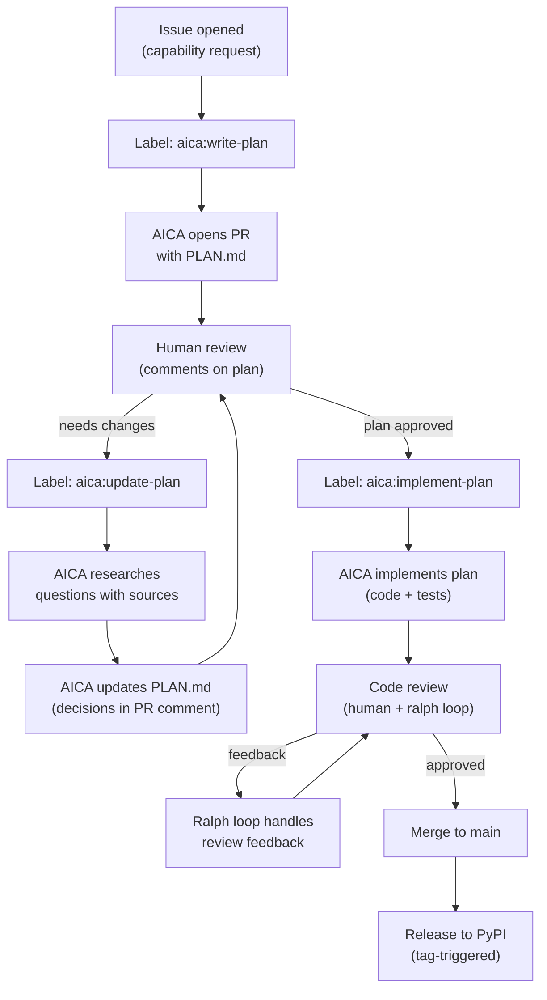
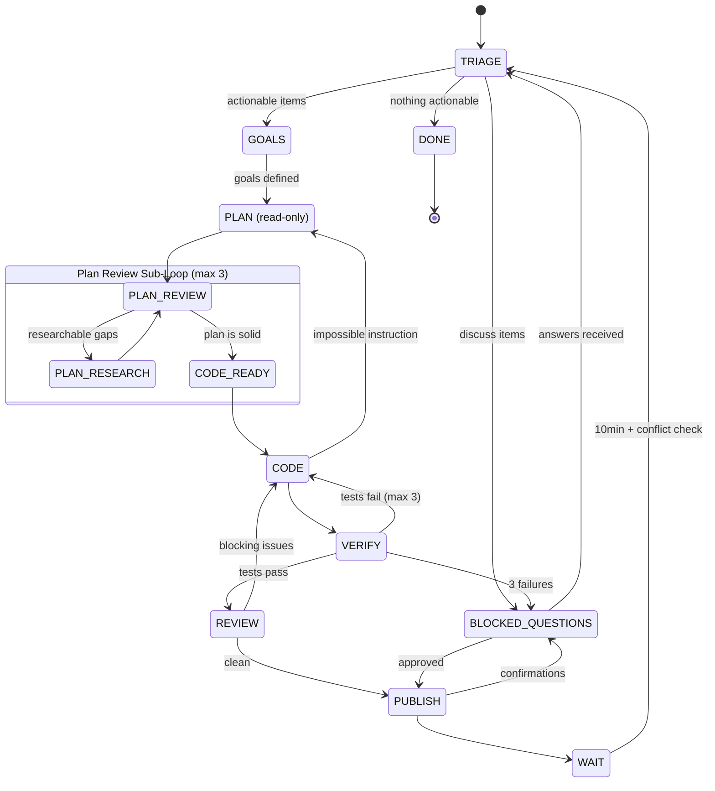
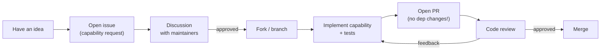
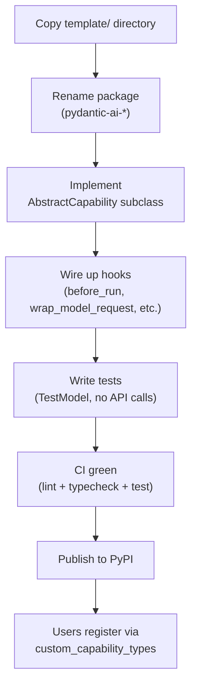
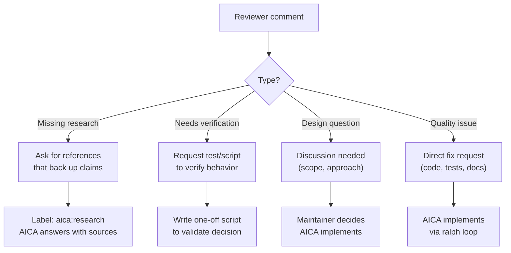

# Development Processes

## Software Factory Flow

How a capability goes from idea to merged code:

## Ralph Loop State Machine

The automated feedback loop that processes PR review comments:

## Contribution Flow

For external contributors:

## Publishing a Capability Package

For building and publishing standalone capability packages:

## Human Review Types

What maintainers focus on during plan and code review:

